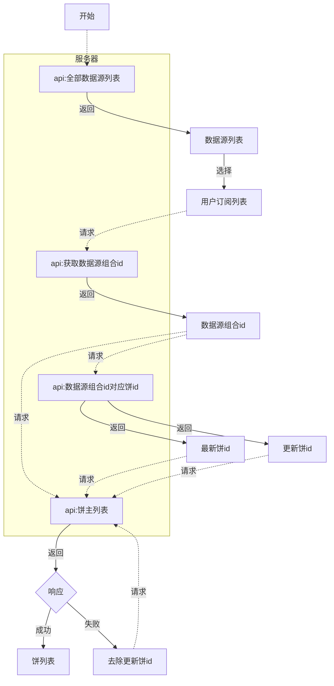

# 小刻食堂就餐指引

```mermaid
flowchart TB
    subgraph 服务器
        cookies_main_list_api[api:饼主列表]
        comb_id_map_cookie_ids_api[api:数据源组合id对应饼id]
        comb_id_api[api:获取数据源组合id]
        datasource_api[api:全部数据源列表]
    end
    start[开始]
    start -.-> datasource_api
    datasource_api -- 返回 --> datasource[数据源列表]
    datasource -- 选择 --> user_subs[用户订阅列表]
    user_subs -. 请求 .-> comb_id_api
    comb_id_api -- 返回 --> comb_id[数据源组合id]
    comb_id -. 请求 .-> comb_id_map_cookie_ids_api
    comb_id_map_cookie_ids_api -- 返回 --> latest_cookie_id[最新饼id]
    comb_id_map_cookie_ids_api -- 返回 --> update_cookie_id[更新饼id]
    comb_id -. 请求 .-> cookies_main_list_api
    latest_cookie_id -. 请求 .-> cookies_main_list_api
    update_cookie_id -. 请求 .-> cookies_main_list_api
    cookies_main_list_api -- 返回 --> result{响应}
    result -- 成功 --> cookies[饼列表]
    result -- 失败 --> again[去除更新饼id]
    again -. 请求 .-> cookies_main_list_api
```
